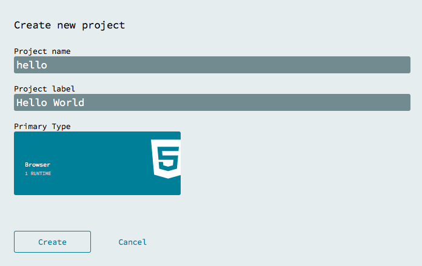
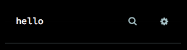
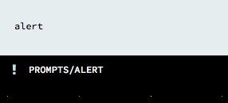
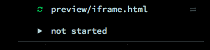

Follow these directions to make a "Hello World" NoFlo browser project with two nodes and one edge.

We recommend Chrome 33+ or Firefox 28+.

## Make a project

1. Load [app.flowhub.io](http://app.flowhub.io)
2. Log in (optional, [more info](../github-integration/))
3. Under "Projects" click "Create"
4. Give your project a name and label
5. Choose "Browser" as the primary type. (Unless you have set up a Node runtime, that will be the only option.)
6. Tap "Create" and the UI should load, showing a blank canvas

## Search and add components

1.  In the top-left is the library search box, tap there to show search input  
    
2.  Search for "alert," then tap `prompts/Alert` to add that component to your graph  
    
3.  Search for and add one `core/Repeat` component
4.  Move them so `Alert` is to the right of `Repeat`

## Navigate

Pan the graph by dragging the background. Zoom with scroll wheel, 2-finger scroll gesture, or pinch.

If part of the graph is not in the window, a minimap should appear in the bottom-right. You can click that to fit the graph to the window.

## Connect

There are several ways to connect nodes, depending on your setup and personal preference. You can either tap one port and then the other, or drag from one port to the other. If you are zoomed out, you can open the node context menu by tap-and-hold or secondary click. Then you can tap one of the the expanded port names to start a connection.

1. Connect `Repeat`'s `out` port to `Alert`'s `in` port
2. Click on this new edge to see its inspector and change the edge color

## Inspect a component and edit its initial information packets

Initial information packets (IIPs) are the data that is send to the process when the network starts. `core/Repeat` will send that data on to anything connected, which makes it a good way to automatically start a network.

1. Tap the `Repeat` node to see its inspector
2. In the text input field by `in`, type "hello world"

## Run

1.  In the top-left is a play icon with the words "not started," tap it to start the network  
    
2.  The preview panel should open, and the "hello world" alert should pop up

Congratulations! Your first client-side NoFlo graph is running.

## Further exploration

The preview graph runs in an iframe. If you want to have some HTML content ready there when you start the graph, tap the cog icon by the search box. This will open the graph settings dialog, where you can put HTML in the "preview contents" text area. The [clock example](http://app.flowhub.io/#example/7135158) illustrates setting up and manipulating DOM elements like this.
