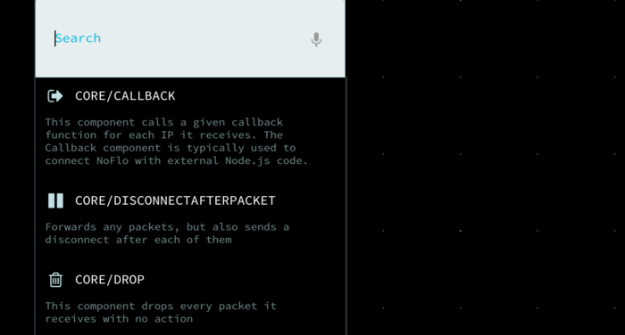
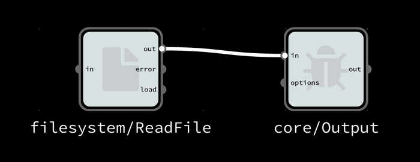
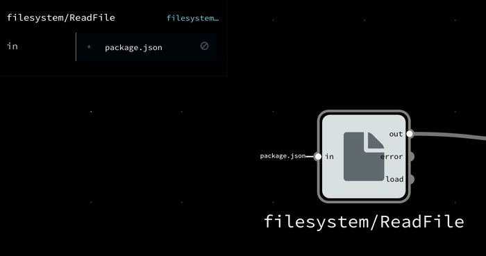

This guide assumes that you know the basic operation of the Flowhub app. So if you haven't done so, it is a good idea to start with the [browser getting started guide](http://flowhub.io/documentation/getting-started-browser/).

## Prepare a Node.js project on server-side

To use NoFlo on the server-side, you need to set up a [Node.js](http://nodejs.org/) project. Ensure that you have a working installation of Node.js 0.10 available. Then you can either add NoFlo to an existing project, or create a new one by:

    $ mkdir noflo-example
    $ cd noflo-example
    $ npm init

Then install NoFlo itself with:

    $ npm install noflo --save

## Installing components

Unlike [browser-side NoFlo](http://flowhub.io/documentation/getting-started-browser/), on Node.js we don't supply any components by default. So, to get components into your project you need to install them locally via [NPM](https://www.npmjs.org/). The [NoFlo library listing](http://noflojs.org/library/) gives a pretty good overview of the common libraries available.

To get started, we could install a set of components for filesystem access, and some "core" components.

    $ npm install noflo-filesystem --save
    $ npm install noflo-core --save

## Connect your server to Flowhub

The Flowhub user interface communicates with your server-side NoFlo instance over WebSockets. For this, you need to install and set up the [noflo-nodejs runtime](https://github.com/noflo/noflo-nodejs#readme). Start by installing it:

    $ npm install noflo-nodejs --save

Then we need to configure it so that it becomes available in the Flowhub user interface. For this we need your Flowhub User Identifier. Get it with:

1. Load [app.flowhub.io](http://app.flowhub.io/)
2. Click "Login" and connect Flowhub with your TheGrid account
3. Click "Settings" and take note of your User Identifier

Then you're ready to configure your local runtime. This is done using the `noflo-nodejs-init` command. You can set up a port, a hostname or IP address, and you also need to provide your Flowhub User Identifier. For example, run:

    $ node node_modules/.bin/noflo-nodejs-init --user <YOUR USER ID> --host localhost --port 3569 --label "Local NoFlo Test"

This will create a `flowhub.json` file inside your project. You'll usually want to add this to your `.gitignore`. You can run `noflo-nodejs-init --help` to see all the possible configuration options.

### Starting the runtime

Once you have a `flowhub.json` file, you can start the runtime with:

    $ node node_modules/.bin/noflo-nodejs

This will read the configuration file and register the runtime with Flowhub. Go to [Flowhub](http://app.flowhub.io) again and refresh the runtime list, and it will show up in your home screen under "Runtimes."

Alternatively you can also edit your package.json and add these line to the scripts section before "test":

    "start": "node node_modules/.bin/noflo-nodejs",

This lets you start the runtime using 'npm start'.

## Make a Flowhub project

1.  Under "Projects" click "Create"
2.  Give your project a name and label
3.  Choose "Node.js" as the primary type  
4.  Tap "Create" and the UI should load, showing a blank canvas
5.  Tap "Select runtime" and chose the runtime that is running on your machine

## Make your first graph

Now you should see that Flowhub is connected to your Node.js runtime, and the library should show the server-side components.

To make a simple server-side filesystem read operation, you can simply add two components:

* `filesystem/ReadFile`
* `core/Output`

Now, connect the `out` port of the ReadFile node to the `in` port of the Output node:

Then you need to tell the ReadFile node which file to read. Click the node and enter an IIP to the `in` port. We could for example read the local project's `package.json` file:

If you now start the graph by clicking the "Play" button on the top-right corner, and then open the preview panel on the right you can see the output that normally would've been sent to `console.log` by Node.js:

You can also see similar information by inspecting the connection itself:

