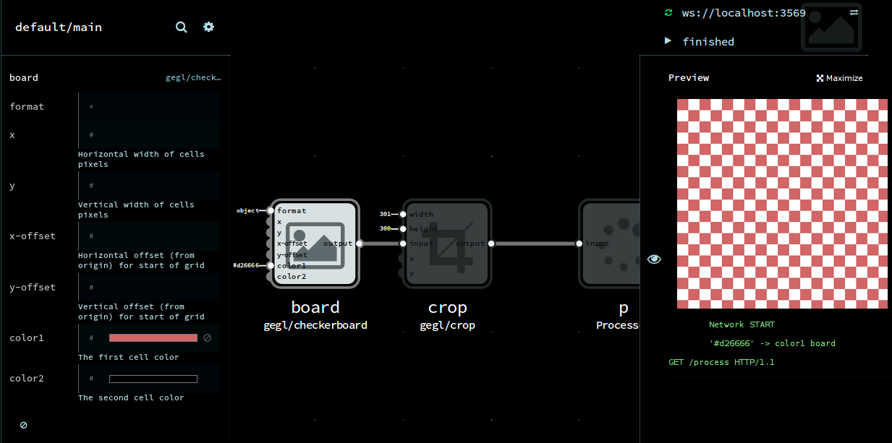
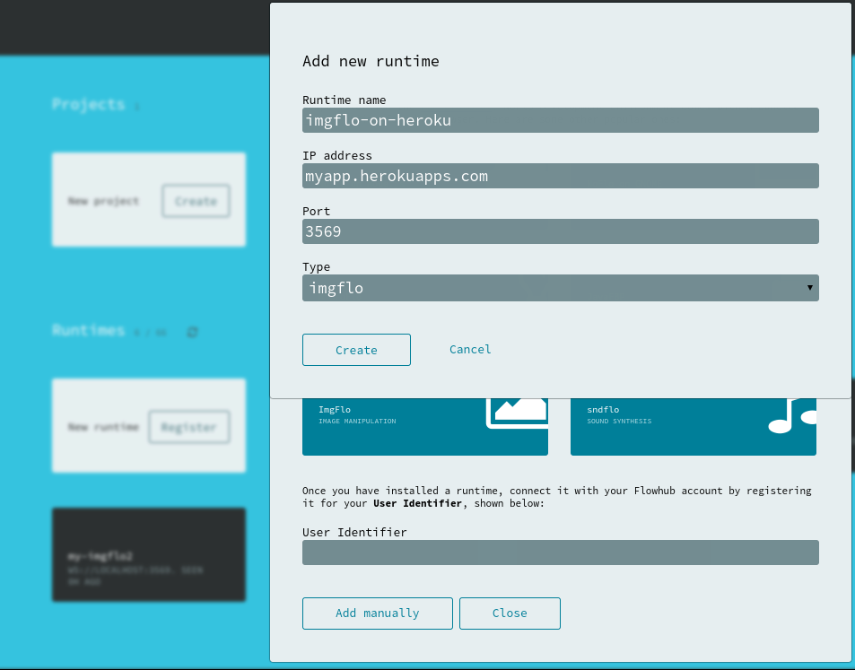
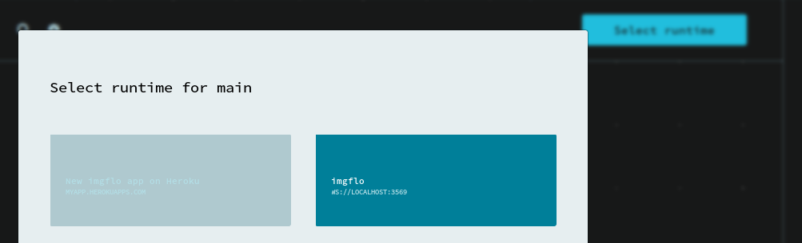
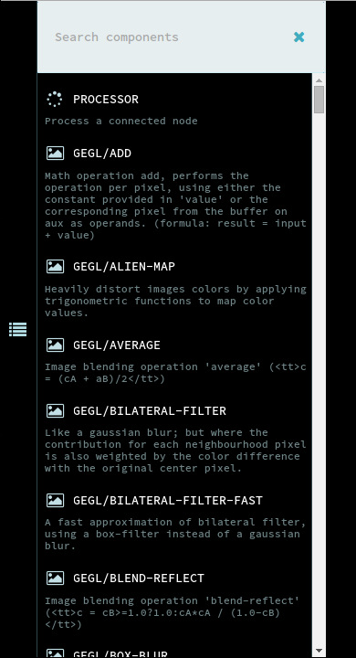
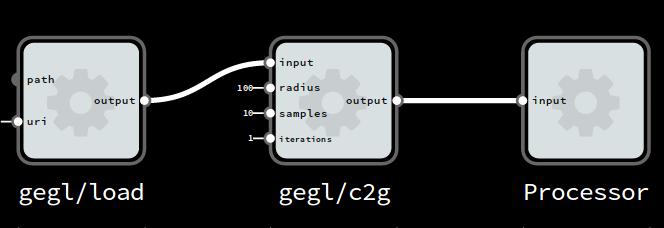
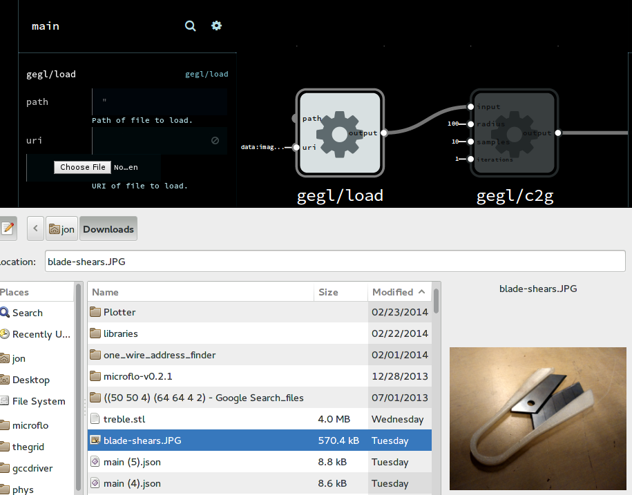
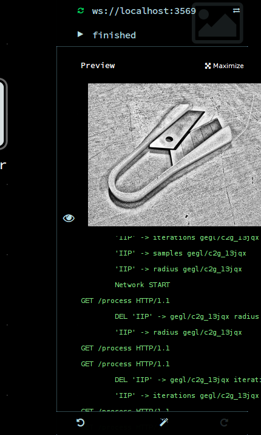

This guide assumes that you know the basic operation of the Flowhub app.
So if you haven't done so, it is a good idea to start with the
[browser getting started guide](http://flowhub.io/documentation/getting-started-browser/).

## Deploying a new runtime on Heroku

imgflo supports one-click deploy to Heroku. Registration & deployment process takes about 2 minutes.
Heroku allows you to have up to 5 apps for free.

Click button below to deploy.

Note: Free Heroku apps are shut down when idle.
So you might see that the runtime disconnects if not doing anything for a minute or two.
Clicking reconnect on the runtime should automatically start it again,
and you should be able to just continue using it as if nothing had changed.

## Alternative: installing a new runtime locally

imgflo currently supports GNU/Linux systems. In the future, Mac OSX and Windows
[might be supported](https://github.com/jonnor/imgflo/issues/3).
If you want to run it locally instead of on Heroku, you can follow the
[build and install instructions](https://github.com/jonnor/imgflo#developing-and-running-locally).

## Testing imgflo runtime in live mode

Open in browser `http://YOURAPP.herokuapps.com` (or `http://localhost:3569` if running locally)

Click on `Open in Flowhub`. This should now open the IDE and show the running graph.

If you now change a property, and open the right side panel you should see output data.

Note: When in live mode, changes you make to the graph are not stored.
See next section for how to get project persistance.

## Adding runtime for project mode use

Manual runtime configuration

On main page, go to `Runtimes` -> `Add new runtime` -> `Add manually`

Enter hostname to be `YOURAPP.herokuapps.com`

Runtime type should be `imgflo`

## Create new project

Open `Projects` -> `Create`, select type `Image Manipulation`

You can select your runtime in upper right corner `Select Runtime`.

## Your first graph

Now you should see that Flowhub is connected to your imgflo runtime,
and the library should show the available components.

To make a simple processing graph, you can add the following components.

* `gegl/load`
* `gegl/c2g`
* `Processor`

And connect them:

Select the `gegl/load` node, and click `Choose File` to open the file to process.
Note: should not be larger than 2000x2000 pixels, as the data gets serialized as a dataURL.
Alternatively, you can paste a HTTP URL in the `uri` field.

To see the output, open the left side panel, and click the play button

Any changes you make to the graph while running will update and re-process the image.
It will show "running" while processing, and "finished" when done.

## Deploy graphs to web using imgflo-server

Using [imgflo-server](https://github.com/jonnor/imgflo-server) one can processing images using a HTTP API.
See [how to add graphs](https://github.com/jonnor/imgflo-server/blob/master/doc/adding-graphs.md)

## Using graphs as GEGL operations

Since January 2014, GEGL git master (to be released as version 0.3) supports loading
serialized imgflo graphs as meta-operations.

Save the graph to JSON by clicking the settings cogwheel and then the download button.

Place the downloaded .json into one of the folders in the GEGL module path,
for instance `$(LIBDIR)/gegl-0.3/` or `~/.local/share/gegl-0.3/plug-ins`

GEGL-based applications, like [GIMP](http://gimp.org),
should now be able to see and use your custom operation.

