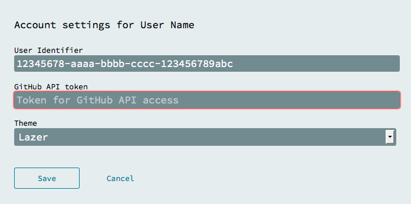

When you log into Flowhub we will perform authentication with GitHub that grants Flowhub access to push to your public repositories. For paid accounts, we also provide access to all [private GitHub repositories](https://github.com/pricing) that you have.

## Setting up GitHub access

1.  Load the home page at [app.flowhub.io](http://app.flowhub.io/)
2.  Tap "Login" and sign in to your GitHub account
3.  After giving TheGrid permission to access your GitHub projects, you'll be redirected back to Flowhub
4.  After a little spinning, you should see your name and icon
5.  Tap "Settings" and verify that we received a GitHub token
    

## Push project to GitHub

If you don't have any projects yet, try the [getting started guide](../getting-started-browser/).

1.  Open a project that you want to push
2.  Open the project panel by clicking the left side of the screen
3.  Tap "Settings"  
4.  Input your GitHub name and repository name and save. If the repository doesn't exist it will be created for you on first push.  
    
5.  You should now have an area to input a commit message and upload.  
    

## Import project from GitHub

In the Flowhub main page you should now be able to switch between "On device" (saved to browser memory) and "GitHub" (your public projects).

When you import a project from there, the "github-name/repo-name" setting will be set for you.
