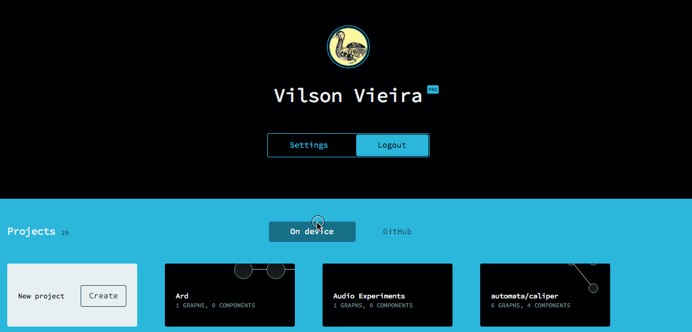
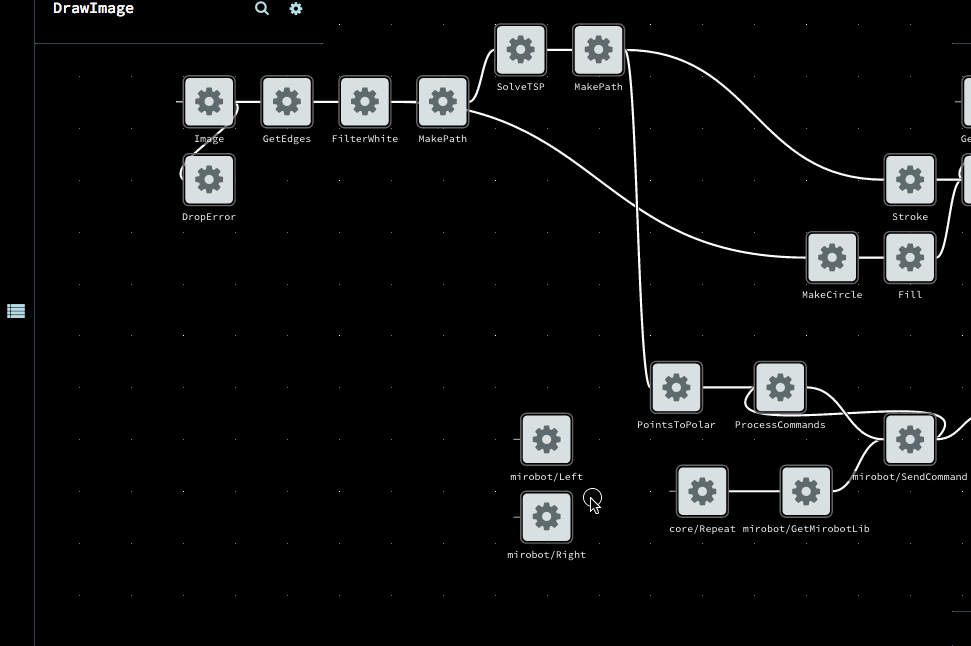
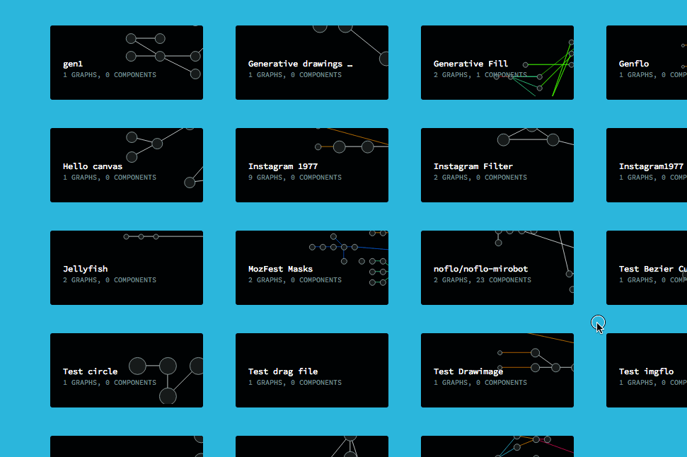

Before starting, make it sure you already have your GitHub access granted. If not, please [read](../github-integration).

It is always possible to create your Flowhub apps locally, using your prefered editor and pushing changes to your
app Git repository. However, it is much more convenient to use Flowhub to create and manage your apps.

## Creating a new app

1. Fork the [noflo-browser-app](https://github.com/noflo/noflo-browser-app) in [GitHub](https://github.com)
2. You can change the app's name and description if you want, using the GitHub UI
3. Import your app in [Flowhub](https://app.flowhub.io)
   
4. Open your app clicking on it
5. Now you are free to make changes in both graphs and components using the Flowhub IDE

## Syncing your app with GitHub

Commiting and pushing your changes to GitHub is as simple as clicking on the Sync button on FlowHub.
A dialog will asks you about what actions you would like to do on the following commits.

Just press Synchronize when you are done and Flowhub will properly synchronize your app with GitHub.

## Autodeploying your app

Flowhub can deploy your app automatically when the GitHub repository receives a new push.

To enable autodeploy on your app you should follow these steps:

1. Change repo name in Gruntfile.coffee
2. Create a personal github access token
3. Enable Travis CI for your fork
4. Change to use your own GH_TOKEN

